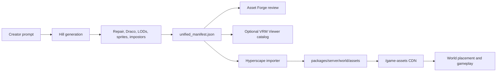

# Unified Asset Pipeline

Hyperscape now treats asset creation, asset inventory, and runtime deployment as
separate stages with one manifest contract between them.

## System Roles

| System | Role | Notes |
| --- | --- | --- |
| Hill | Create and optimize assets | Runs the local DGX pipeline: Nemotron prompt optimization, Flux Klein image generation, Trellis2 mesh generation, mesh repair, Draco compression, LODs, and optional sprites or impostors. |
| Asset Forge | Review and orchestrate generated assets | Stores or uploads generated GLB assets, previews them, and exposes the creator workflow. Hosted previews must not depend on VRM Viewer routes. |
| VRM Viewer | Optional catalog/inspection surface | Can mirror product descriptions, keywords, tags, license metadata, thumbnails, previews, model summaries, and viewer/editor state. It should be able to preview Draco-compressed GLB assets, but it is not required for Asset Forge production routing. |
| Hyperscape | Deploy assets into the MMO | Imports Hill manifests into `packages/server/world/assets`, serves them through the local asset CDN, and patches runtime manifests used by terrain, vegetation, towns, mobs, NPCs, and item placement. |

Asset Forge remains useful as an orchestration and review shell, but the default
creation backend should be Hill/local DGX rather than the legacy cloud-only
OpenAI/Meshy path.

## Lifecycle



The current working Hyperscape importer is
`scripts/import-hill-manifest.mjs`. It reads a Hill `unified_manifest.json`,
copies optimized model and thumbnail files, stores a copy of the source manifest,
and patches vegetation plus biome manifests.

## Import Command

Run from the Hyperscape repo root:

```bash
bun scripts/import-hill-manifest.mjs \
  --manifest /path/to/hill/output/unified_manifest.json \
  --assets-root packages/server/world/assets \
  --biomes plains,forest
```

Useful options:

| Option | Purpose |
| --- | --- |
| `--dry-run` | Print the planned import without writing files. |
| `--no-copy` | Patch manifests only, without copying GLBs or thumbnails. |
| `--no-seed` | Do not fetch missing base `vegetation.json` or `biomes.json` from the asset CDN. |
| `--seed-vegetation-url <url>` | Override the source used to seed a missing vegetation manifest. |
| `--seed-biomes-url <url>` | Override the source used to seed a missing biome manifest. |

The importer writes optimized files under paths like:

```text
packages/server/world/assets/models/hill/<pack>/<pack>_<prop>_<tier>.glb
packages/server/world/assets/icons/hill/<pack>/<pack>_<prop>.png
packages/server/world/assets/manifests/hill/<pack>.unified_manifest.json
```

It currently expects Hill vegetation patches at either:

```text
exports.hyperscape.manifest_patches.vegetation
exports.hyperscape.manifestPatches.vegetation
```

## Unified Manifest Contract

The manifest should preserve the creator-facing metadata needed by Asset Forge
or an optional catalog and the runtime metadata needed by Hyperscape. The
importer only consumes part of this today, but new producers should keep the
full shape stable.

```json
{
  "schemaVersion": "1.0.0",
  "source": {
    "system": "hill",
    "slug": "pine_tree_pack",
    "generator": "local_dgx_trellis2",
    "promptModel": "nemotron",
    "imageModel": "flux_klein",
    "meshModel": "trellis2"
  },
  "product": {
    "title": "Pine Tree Pack",
    "description": "Game-ready pine trees with Draco compression and LODs.",
    "keywords": ["pine", "tree", "forest", "evergreen"],
    "tags": ["vegetation", "tree", "starter-zone"]
  },
  "licensing": {
    "visibility": "public_cc0",
    "license": "CC0-1.0",
    "hasCommercialUse": true
  },
  "assets": [
    {
      "id": "hill:pine_tree_pack:pine_a",
      "name": "Pine A",
      "identity": {
        "slug": "pine_tree_pack",
        "prop_slug": "pine_a"
      },
      "type": "environment",
      "subtype": "tree",
      "description": "Medium pine tree for forest fill.",
      "keywords": ["pine", "tree", "forest"],
      "files": {
        "optimized_webp": {
          "default": { "path": "/abs/path/pine_a_default.glb" },
          "lod0": { "path": "/abs/path/pine_a_lod0.glb" },
          "lod1": { "path": "/abs/path/pine_a_lod1.glb" },
          "lod2": { "path": "/abs/path/pine_a_lod2.glb" }
        }
      },
      "media": {
        "thumbnail": { "path": "/abs/path/pine_a.png" }
      },
      "geometry": {
        "polyBucket": "game",
        "triangles": {
          "lod0": 52000,
          "lod1": 16000,
          "lod2": 4200
        },
        "dracoCompressed": true
      },
      "runtime": {
        "category": "tree",
        "biomes": ["plains", "forest"],
        "collision": "bounds",
        "renderDistance": 420
      }
    }
  ],
  "exports": {
    "hyperscape": {
      "manifest_patches": {
        "vegetation": [
          {
            "id": "hill_pine_tree_pack_pine_a",
            "category": "tree",
            "baseScale": 1,
            "weight": 1,
            "lods": {
              "default": "hill/pine_tree_pack/pine_tree_pack_pine_a_default.glb",
              "lod0": "hill/pine_tree_pack/pine_tree_pack_pine_a_lod0.glb",
              "lod1": "hill/pine_tree_pack/pine_tree_pack_pine_a_lod1.glb",
              "lod2": "hill/pine_tree_pack/pine_tree_pack_pine_a_lod2.glb"
            }
          }
        ]
      }
    }
  }
}
```

## Visibility and Licensing

Free generation should default to world-building assets:

| Visibility | Use |
| --- | --- |
| `public_cc0` | Free-tier assets. Public, CC0-like, eligible for curated world pools after moderation. |
| `private_personal` | Subscription/personal assets with private library access. |
| `private_commercial` | Paid/pro assets with full commercial licensing rights. |
| `platform_curated` | Assets selected for first-party placement in the shared world. |

Hyperscape should not model asset ownership through Web3 tokens or NFTs. If paid
generation is wired later, it should use normal credits with Stripe first and
Lightning only as an optional payment rail.

## Runtime Budgets

Trees and vegetation are the first optimization target because several existing
tree GLBs are large enough to hurt boot time, network transfer, and memory.

| Tier | Target | Suggested texture |
| --- | --- | --- |
| LOD0 hero | 40k-60k triangles | 1024px WebP |
| LOD1 game | 10k-20k triangles | 512px WebP |
| LOD2 distant | 1k-5k triangles or card cluster | 256px WebP |
| LOD3 impostor | Billboard or octahedral atlas | Atlas WebP |

Every imported vegetation asset should have:

- A thumbnail for Asset Forge library browsing and any optional catalog.
- At least `lod0`, `lod1`, and `lod2` GLBs.
- Draco-compressed geometry where possible.
- Product description, keywords, tags, visibility, and license fields.
- Biome and placement hints for Hyperscape.
- A moderation status before becoming part of curated world pools.

## Acceptance Checklist

Before an asset pack is treated as deployable:

- `bun scripts/import-hill-manifest.mjs --manifest <file> --dry-run` succeeds.
- The manifest copy appears under `packages/server/world/assets/manifests/hill/`.
- Copied model paths resolve through the asset CDN at `/game-assets/...`.
- Draco-compressed GLBs load in Asset Forge and in Hyperscape.
- Vegetation entries include reasonable LOD distances and biome coverage.
- The asset stays inside category budgets for triangles, texture size, and file size.
- Free-tier assets use `public_cc0`; paid/private assets preserve creator licensing metadata.
